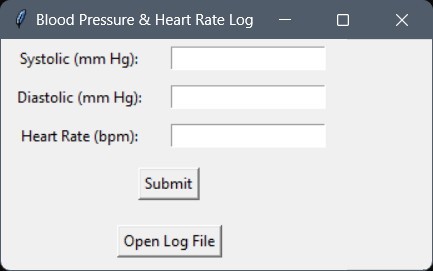

# Blood Pressure & Heart Rate Log

This project is a standalone executable application for logging blood pressure and heart rate data. It provides a user-friendly graphical interface that allows users to enter their systolic and diastolic blood pressure readings along with their heart rate. The application saves the data to an Excel file, provides feedback on the readings, and allows users to open the log file directly from the application.

## Features

- User-friendly interface built with Tkinter.
- Input fields for systolic and diastolic blood pressure, and heart rate.
- Real-time feedback based on entered data:
  - **Blood Pressure Status**:
    - Normal
    - Elevated
    - Stage 1 Hypertension
    - Stage 2 Hypertension
  - **Heart Rate Status**:
    - Normal
    - Slightly above normal
    - Above normal
    - Elevated heart rate
- Saves entries to an Excel file.
- Opens the Excel file directly from the application.
- Standalone executable file for easy distribution.

  
*Example of the GUI interface.*

## Requirements

- Windows operating system.
- No additional dependencies are required to run the standalone executable.

## Installation

1. **Download the Executable**:
   Download the standalone executable from the [releases section](<https://github.com/ericjada/MyFirstPythonProjects/releases/tag/v1.0-blood-pressure-log>) of the repository.

2. **Run the Application**:
   Double-click the downloaded `.exe` file to launch the application.

## Usage

1. Enter your systolic and diastolic blood pressure values in mm Hg.
2. Enter your heart rate in beats per minute (bpm).
3. Click **Submit** to save your entry. A message box will display your health status based on the entered values.
4. Click **Open Log File** to view your saved entries in Excel.

## File Storage

The application saves the log to an Excel file named `BloodPressure_HeartRate_Log.xlsx` in the same directory as the executable.

