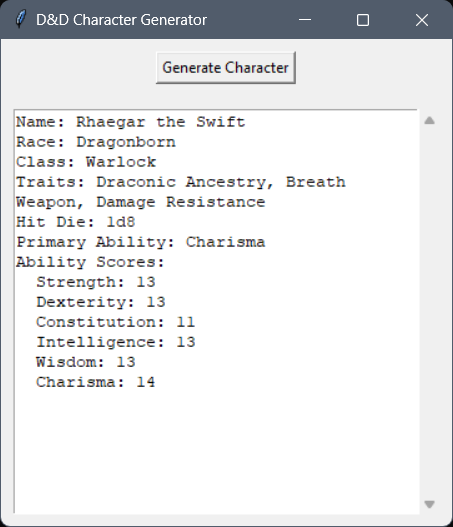

# DnD Character Generator

This DnD Character Generator is a Python application that creates random characters for Dungeons & Dragons gameplay. It provides a user-friendly graphical interface using Tkinter, allowing players to quickly generate characters complete with race, class, traits, and ability scores.

## Features

- Randomly selects a character race from a diverse list (e.g., Human, Elf, Dwarf, Halfling, etc.).
- Randomly selects a character class (e.g., Barbarian, Wizard, Rogue, etc.).
- Rolls ability scores using the standard method (4d6 drop the lowest).
- Generates unique names based on the selected race, including a title to personalize the character.
- Displays the generated character's details in a clear and readable format.

## How It Works

1. **Races and Classes**: The application includes predefined lists of races and classes, each with specific traits and ability bonuses.
2. **Ability Score Generation**: Ability scores are generated using the standard method, ensuring balanced and playable characters.
3. **Name Generation**: Each character receives a random name from a predefined set of names based on their race, along with a unique title.
4. **User Interface**: The application features a simple GUI built with Tkinter, allowing users to generate and view characters with a single click.

## Installation

1. **Download the Executable**:
   Download the standalone executable from the [releases section](<https://github.com/ericjada/MyFirstPythonProjects/releases/tag/v1.0-dnd-character-generator>) of the repository.

2. **Run the Application**:
   Double-click the downloaded `.exe` file to launch the application.

## Usage

Click the "Generate Character" button in the GUI to create a new D&D character.
The character's details will be displayed in the text area, including their name, race, class, traits, hit die, primary ability, and ability scores.

  
*Example of the GUI interface.*