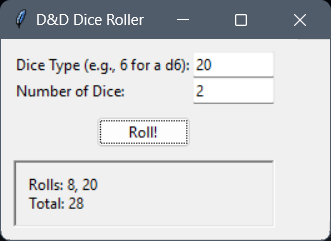

# D&D Dice Roller

A simple dice rolling simulator designed for Dungeons & Dragons. This application allows users to roll various dice (d4, d6, d8, d10, d12, d20, and d100) with an easy-to-use graphical interface.

## Features

- Roll any standard D&D dice (d4, d6, d8, d10, d12, d20, d100).
- Simulates real-world dice rolling with randomized outputs.
- Built with a simple GUI using `tkinter`.
- Available as a standalone executable (no Python required for end-users).

### Screenshots

  
*Example of the GUI interface.*
