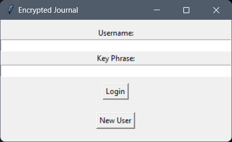
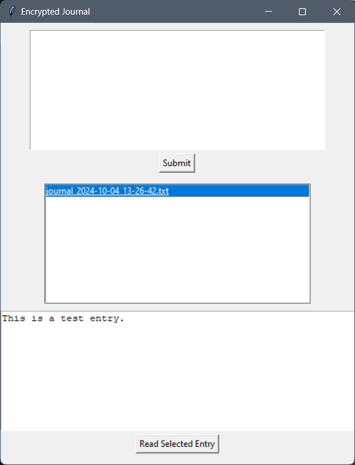

# Encrypted Journal Program

## Description

This program is a simple encrypted journal application built with Python and Tkinter. It allows users to create encrypted journal entries, which are stored in text files organized by user. Each user's entries are encrypted with a key phrase they provide during login, ensuring privacy and security. The program features a user-friendly graphical interface (GUI) and saves the entries in `.txt` files, organized by date and user.

This project is designed to run as a standalone executable, making it easy for anyone to use, regardless of whether they have Python installed.

## Features

- **User Authentication**: Users log in with a username and key phrase. New users can be created from the login screen.
- **Encryption**: Journal entries are encrypted using the key phrase and saved to a `.txt` file. Only users with the correct key phrase can decrypt and view their entries.
- **Organized Storage**: Entries are saved in folders by user, with filenames based on the date and time of submission.
- **Easy Navigation**: A graphical user interface (GUI) allows users to submit new journal entries and view or decrypt existing ones.
- **Cross-Platform**: The program can be packaged into an executable for easy use on any platform without needing Python installed.

## How It Works

1. **Login**: 
   - Enter your username and key phrase. If the username doesn't exist, you can create a new user with that name.
   - If the key phrase is incorrect, the journal entries cannot be decrypted.
   
2. **Main Interface**: 
   - **Submit Journal Entries**: Type your journal entry and submit it. The entry is encrypted and saved in your user folder with a date and time stamp.
   - **View Journal Entries**: The list of your journal entries appears in the main window. Select a file to view, and it will be decrypted and displayed in the text box.

## Installation

1. **Download the Executable**:
   Download the standalone executable from the [releases section](<https://github.com/ericjada/MyFirstPythonProjects/releases>) of the repository.

2. **Run the Application**:
   Double-click the downloaded `.exe` file to launch the application.

## Technologies Used

- **Python 3**
- **Tkinter** for the graphical user interface (GUI)
- **Cryptography** for encryption and decryption of journal entries

  
*Example of the GUI interface.*

  
*Example of the GUI interface.*