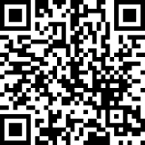

# MyFirstPythonProjects
 These are my first ever python projects.

Welcome to **My First Python Projects**! This repository is a collection of beginner-friendly Python projects that I've created to enhance my programming skills. Each folder contains a separate project, showcasing different concepts and functionalities in Python.

## Support My Projects

If you enjoy my work and would like to support my projects, consider making a donation via PayPal. Your contributions help me continue developing new projects. Every little bit helps!

[Donate via PayPal](https://www.paypal.com/donate/?hosted_button_id=NSFMYDYRMWMDY)

Thank you for your support!

## Acknowledgments

I would like to express my gratitude to ChatGPT, an AI language model developed by OpenAI, for providing invaluable assistance and guidance throughout the development of my projects in this repository. From brainstorming ideas to troubleshooting and documentation, the support has significantly enhanced my learning experience and project outcomes.

## Disclaimers
- **No Professional Endorsement:** These projects are created for educational purposes and may not meet professional standards. Use them at your own discretion.
- **Limited Functionality:** These projects are designed for beginners and may lack advanced features or robust error handling.
- **No Warranty:** These projects are provided "as is" without any warranty of any kind, either express or implied. The author is not responsible for any damages or issues arising from the use of these projects.
- **Third-Party Libraries:** Some projects may rely on third-party libraries or packages, and their functionality may depend on the correct installation and compatibility of these dependencies.
- **Local Testing Only:** These projects are designed for local testing and development environments. They may not function correctly in all deployment scenarios or operating systems.
- **Health and Safety Disclaimer:** Projects involving health-related data are not substitutes for professional medical advice or services.

