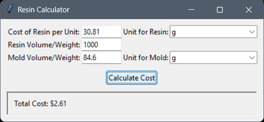

# Resin Calculator

A simple Python application designed to help you calculate the cost of casting a mold in resin. The calculator allows you to input the cost of the resin, the weight or volume of the resin used, and the weight or volume of the mold, with options to select the appropriate units.

## Installation

1. **Download the Executable**:
   Download the standalone executable from the [releases section](<https://github.com/ericjada/MyFirstPythonProjects/releases/tag/v1.0-resin-calculator>) of the repository.

2. **Run the Application**:
   Double-click the downloaded `.exe` file to launch the application.

## Features

- Input the price of resin.
- Input the weight or volume of resin used for casting.
- Input the weight or volume of the mold.
- Select units for weight (grams, kilograms) and volume (milliliters, liters, cubic centimeters).
- Calculate the total cost of resin used based on the input values.

  
*Example of the GUI interface.*